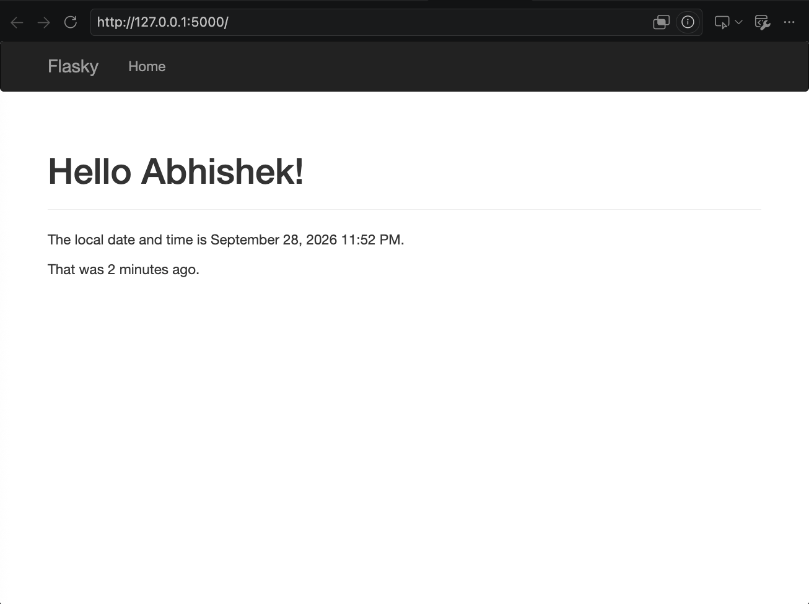
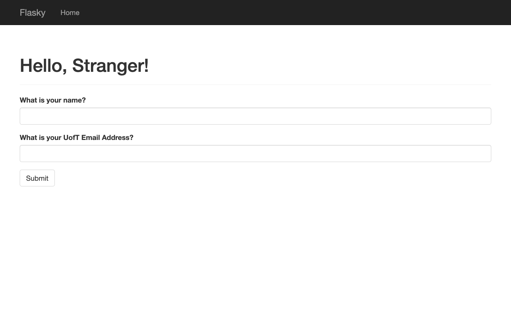
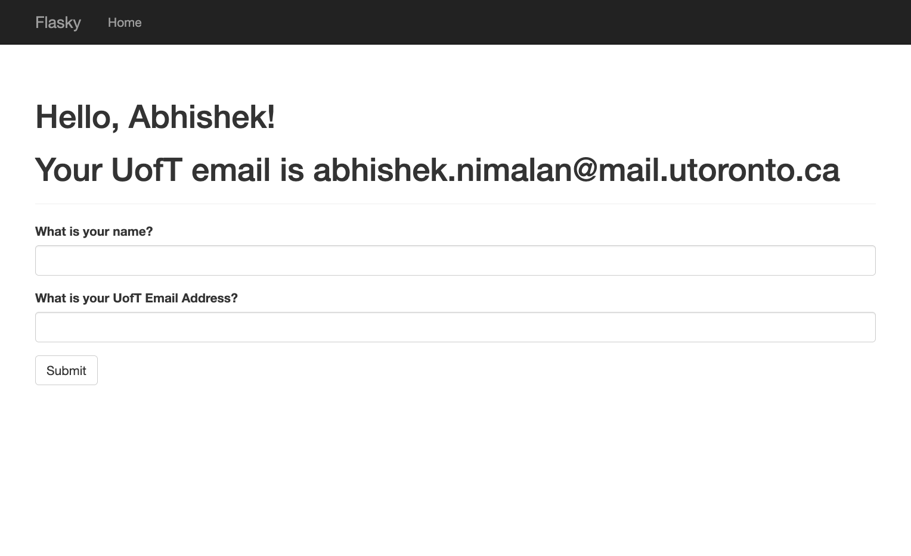
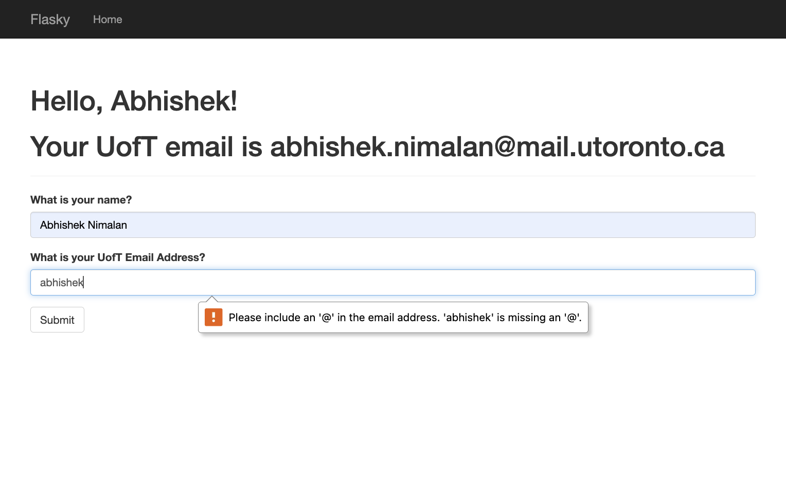
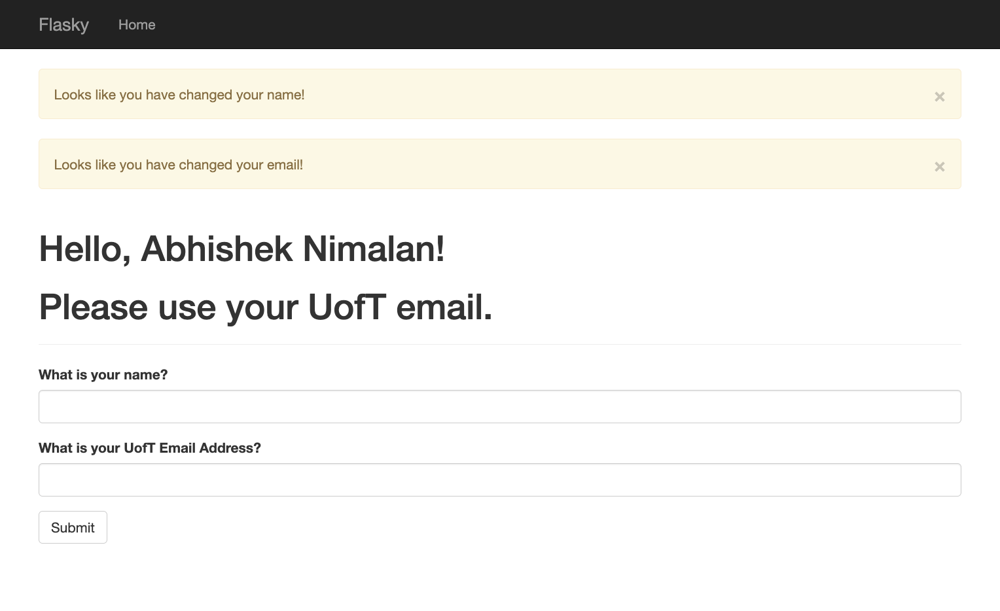

# Abhishek Nimalan

This repo is for ECE444 PRA 3. It is a clone of https://github.com/miguelgrinberg/flasky (Examples from Flask Web Development: Developing Web Applications with Python by Miguel Grinberg, O'Reilly, 2nd Edition). 

# Activity 1.3 (Chapter 3 Example)

# Activity 1.4 (Chapter 4 Example)

